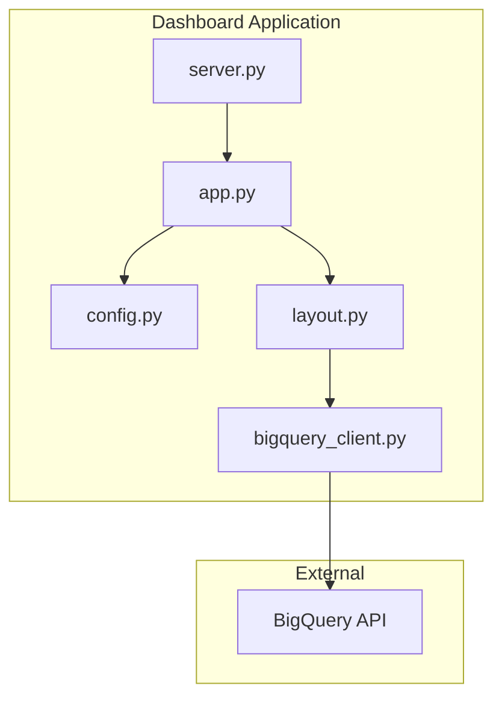
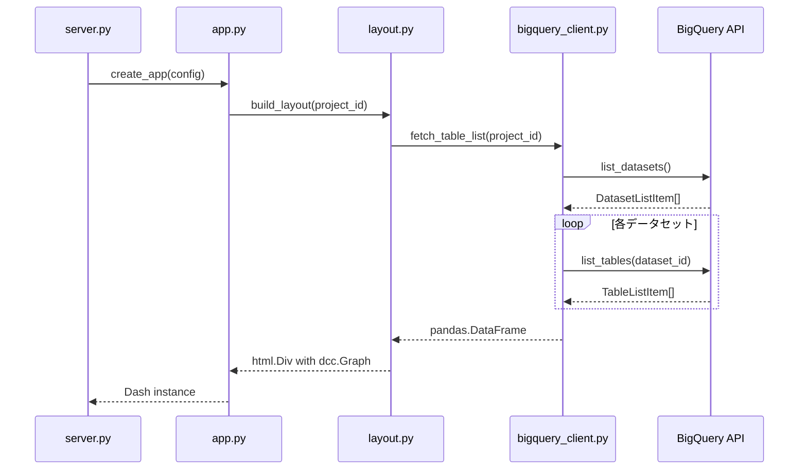

# Technical Design Document

## Overview

**Purpose**: 本機能は、対象GCPプロジェクトのBigQueryテーブル一覧をダッシュボードのトップページに表形式で表示する機能を提供する。

**Users**: データ基盤管理者がテーブルの存在状況を把握するために利用する。

**Impact**: 既存のダッシュボードアプリケーションに新規モジュール（`bigquery_client.py`）を追加し、`layout.py` を拡張してテーブル表示機能を実現する。

### Goals

- 対象プロジェクトの全BigQueryテーブル情報（データセット名・テーブル名）を取得する
- 取得したテーブル情報を pandas.DataFrame として保持する
- Plotly テーブルコンポーネントでトップページに表形式で表示する
- 既存のレイヤードアーキテクチャに従ったシンプルな実装

### Non-Goals

- テーブルのメタデータ（行数、サイズ、作成日時等）の取得
- テーブル一覧のフィルタリング・検索機能
- リアルタイム更新・自動リフレッシュ機能
- テーブル詳細画面への遷移

## Architecture

### Existing Architecture Analysis

既存のダッシュボードアプリケーションは以下のレイヤードアーキテクチャを採用している：

- `config.py`: Pydantic による設定管理
- `layout.py`: UI コンポーネント構築
- `app.py`: Dash インスタンス生成
- `server.py`: サーバー起動ロジック

本機能は既存アーキテクチャを維持しつつ、BigQuery クライアント処理を新規モジュールとして追加する。

### Architecture Pattern & Boundary Map



**Architecture Integration**:
- **Selected pattern**: 関数ベースのレイヤードアーキテクチャ（既存パターン踏襲）
- **Domain/feature boundaries**: BigQuery クライアント処理は `bigquery_client.py` に集約
- **Existing patterns preserved**: Pydantic 設定、関数ベース実装、絶対インポート
- **New components rationale**: `bigquery_client.py` のみ追加（責務分離のため）
- **Steering compliance**: `structure.md` の単一責任原則、`tech.md` の型安全要件を維持

### Technology Stack

| Layer | Choice / Version | Role in Feature | Notes |
|-------|------------------|-----------------|-------|
| Backend / Services | google-cloud-bigquery >=3.0.0 | BigQuery API クライアント | 既存依存関係 |
| Data / Storage | pandas (plotly依存) | DataFrame によるデータ保持 | Plotly に含まれる |
| Frontend / CLI | dash >=2.18.0, plotly | UI フレームワーク、テーブル描画 | 既存依存関係 |

## System Flows

### データ取得・表示フロー



**Key Decisions**:
- アプリケーション起動時に一度だけデータ取得（要件1.1に準拠）
- API エラー時は例外をキャッチしてエラーメッセージを表示

## Requirements Traceability

| Requirement | Summary | Components | Interfaces | Flows |
|-------------|---------|------------|------------|-------|
| 1.1 | 起動時にテーブル一覧取得 | bigquery_client.py | fetch_table_list() | データ取得フロー |
| 1.2 | データセット名・テーブル名取得 | bigquery_client.py | fetch_table_list() | データ取得フロー |
| 1.3 | DataFrame として保持 | bigquery_client.py | fetch_table_list() | - |
| 1.4 | 接続エラー時のメッセージ表示 | layout.py | build_layout() | - |
| 2.1 | トップページに表形式表示 | layout.py | build_layout() | データ取得フロー |
| 2.2 | データセット名カラム | layout.py | create_table_figure() | - |
| 2.3 | テーブル名カラム | layout.py | create_table_figure() | - |
| 2.4 | 0件時のメッセージ表示 | layout.py | build_layout() | - |
| 3.1 | Plotly テーブル使用 | layout.py | create_table_figure() | - |
| 3.2 | DataFrame から Plotly 変換 | layout.py | create_table_figure() | - |
| 4.1 | レイヤードアーキテクチャ準拠 | 全コンポーネント | - | - |
| 4.2 | 関数ベース実装 | 全コンポーネント | - | - |
| 4.3 | BigQuery 処理の集約 | bigquery_client.py | - | - |

## Components and Interfaces

| Component | Domain/Layer | Intent | Req Coverage | Key Dependencies (P0/P1) | Contracts |
|-----------|--------------|--------|--------------|--------------------------|-----------|
| bigquery_client.py | Data Access | BigQuery API を呼び出しテーブル一覧を DataFrame で返却 | 1.1, 1.2, 1.3, 4.3 | google-cloud-bigquery (P0) | Service |
| layout.py (拡張) | UI | テーブル表示コンポーネントを構築 | 1.4, 2.1, 2.2, 2.3, 2.4, 3.1, 3.2 | bigquery_client (P0), plotly (P0) | Service |
| config.py (拡張) | Config | project_id 設定を追加 | 4.1 | pydantic (P0) | State |
| app.py (拡張) | Application | layout 呼び出し時に project_id を渡す | 4.1 | config (P0), layout (P0) | - |

### Data Access Layer

#### bigquery_client.py

| Field | Detail |
|-------|--------|
| Intent | BigQuery API を使用して対象プロジェクトのテーブル一覧を取得し DataFrame として返却する |
| Requirements | 1.1, 1.2, 1.3, 4.3 |

**Responsibilities & Constraints**
- BigQuery API との通信を一元管理
- データセット・テーブル情報の取得と DataFrame への変換
- 認証エラー・API エラーのハンドリング

**Dependencies**
- External: google-cloud-bigquery - BigQuery API クライアント (P0)
- External: pandas - DataFrame 生成 (P0)

**Contracts**: Service [x] / API [ ] / Event [ ] / Batch [ ] / State [ ]

##### Service Interface

```python
from pandas import DataFrame

def fetch_table_list(project_id: str) -> DataFrame:
    """対象プロジェクトの全テーブル一覧を取得する。

    Args:
        project_id: GCP プロジェクト ID

    Returns:
        データセット名とテーブル名を含む DataFrame。
        カラム: dataset_id (str), table_id (str)

    Raises:
        google.api_core.exceptions.GoogleAPIError: BigQuery API 呼び出しに失敗した場合
    """
    ...
```

- Preconditions: Application Default Credentials (ADC) が設定されていること
- Postconditions: 全データセットの全テーブル情報を含む DataFrame を返却
- Invariants: 返却される DataFrame は常に `dataset_id`, `table_id` カラムを持つ

**Implementation Notes**
- Integration: `bigquery.Client()` は ADC を自動検出して認証
- Validation: project_id が空文字の場合は ValueError をスロー
- Risks: 大量のデータセット・テーブルがある場合は取得に時間がかかる可能性

### UI Layer

#### layout.py (拡張)

| Field | Detail |
|-------|--------|
| Intent | BigQuery テーブル一覧を Plotly テーブルとして表示する UI コンポーネントを構築 |
| Requirements | 1.4, 2.1, 2.2, 2.3, 2.4, 3.1, 3.2 |

**Responsibilities & Constraints**
- テーブルデータの Plotly Figure への変換
- エラー状態・空データ状態の表示ハンドリング
- 既存の build_layout() 関数の拡張

**Dependencies**
- Inbound: app.py - レイアウト構築依頼 (P0)
- Outbound: bigquery_client.py - テーブル一覧取得 (P0)
- External: plotly.graph_objects - テーブル描画 (P0)
- External: dash - UI コンポーネント (P0)

**Contracts**: Service [x] / API [ ] / Event [ ] / Batch [ ] / State [ ]

##### Service Interface

```python
from dash import html
from pandas import DataFrame
import plotly.graph_objects as go

def build_layout(project_id: str | None = None) -> html.Div:
    """ダッシュボードレイアウトを構築する。

    Args:
        project_id: GCP プロジェクト ID。None の場合はテーブル表示をスキップ。

    Returns:
        ダッシュボードのルート Div コンポーネント。
    """
    ...

def create_table_figure(df: DataFrame) -> go.Figure:
    """DataFrame から Plotly テーブル Figure を生成する。

    Args:
        df: dataset_id, table_id カラムを含む DataFrame

    Returns:
        Plotly Figure オブジェクト
    """
    ...
```

- Preconditions: なし（project_id が None の場合はテーブル非表示）
- Postconditions: 有効な html.Div を返却
- Invariants: エラー発生時もクラッシュせずエラーメッセージを表示

**Implementation Notes**
- Integration: `dcc.Graph(figure=fig)` で Plotly Figure を埋め込み
- Validation: DataFrame が空の場合は「テーブルが存在しません」メッセージを表示
- Risks: API エラー時は try-except でキャッチしてエラーメッセージを表示

### Config Layer

#### config.py (拡張)

| Field | Detail |
|-------|--------|
| Intent | BigQuery プロジェクト ID の設定を追加 |
| Requirements | 4.1 |

**Responsibilities & Constraints**
- project_id 設定の追加（既存 AppConfig の拡張）
- 環境変数からのデフォルト値取得

**Dependencies**
- External: pydantic - 設定バリデーション (P0)

**Contracts**: Service [ ] / API [ ] / Event [ ] / Batch [ ] / State [x]

##### State Management

```python
from pydantic import BaseModel, Field
from typing import Optional
import os

class AppConfig(BaseModel):
    """Application configuration."""

    # 既存フィールド
    title: str = Field(default="BigQueryテーブル利用状況", ...)
    host: str = Field(default="127.0.0.1", ...)
    port: int = Field(default=8050, ...)
    debug: bool = Field(default=True, ...)

    # 新規フィールド
    project_id: str = Field(
        default=os.environ["GOOGLE_CLOUD_PROJECT"],
        description="BigQuery 対象プロジェクト ID",
    )
```

- State model: Pydantic BaseModel による不変設定
- Persistence: 環境変数 `GOOGLE_CLOUD_PROJECT` からデフォルト取得
- Concurrency strategy: 設定は起動時に一度だけ読み込み（不変）

**Implementation Notes**
- Integration: 環境変数が未設定の場合は None となり、テーブル表示をスキップ
- Validation: project_id は Optional のためバリデーションエラーは発生しない
- Risks: なし

## Data Models

### Domain Model

本機能で扱うドメインモデルは単純な構造のため、pandas.DataFrame で十分に表現可能。

**エンティティ**:
- **TableInfo**: テーブル情報を表す概念的なエンティティ
  - `dataset_id`: str - データセット識別子
  - `table_id`: str - テーブル識別子

**集約**:
- テーブル一覧は単純なリストとして保持（集約ルートは不要）

**不変条件**:
- dataset_id と table_id は常に非空文字列

### Logical Data Model

**DataFrame Structure**:

| Column | Type | Description | Nullable |
|--------|------|-------------|----------|
| dataset_id | str | データセット識別子 | No |
| table_id | str | テーブル識別子 | No |

**Indexing**:
- 特別なインデックスは不要（表示用途のみ）

### Data Contracts & Integration

**BigQuery API Response Mapping**:

| API Object | Property | DataFrame Column |
|------------|----------|------------------|
| TableListItem | dataset_id | dataset_id |
| TableListItem | table_id | table_id |

## Error Handling

### Error Strategy

本機能はシンプルな表示機能のため、エラー発生時はユーザーに分かりやすいメッセージを表示する方針を採用。

### Error Categories and Responses

**User Errors (4xx equivalent)**:
- 該当なし（ユーザー入力は存在しない）

**System Errors (5xx equivalent)**:
- BigQuery API 接続エラー: エラーメッセージをダッシュボードに表示
- 認証エラー: ADC 設定方法を案内するメッセージを表示

**Business Logic Errors**:
- テーブル0件: 「テーブルが存在しません」メッセージを表示（エラーではなく正常系）

### Monitoring

- エラー発生時は標準エラー出力にログを記録
- 詳細なモニタリングは本機能のスコープ外

## Testing Strategy

### Unit Tests

テスト対象モジュール: `bigquery_client.py`, `layout.py`

- `fetch_table_list()` が DataFrame を返却することを検証（モック使用）
- `create_table_figure()` が go.Figure を返却することを検証
- `build_layout()` が html.Div を返却することを検証
- エラー発生時のハンドリングを検証

### Integration Tests

- 実際の BigQuery API を使用したテーブル一覧取得（`@pytest.mark.integration`）
- 環境変数 `GOOGLE_CLOUD_PROJECT` を使用

## Optional Sections

### Security Considerations

- **認証**: Application Default Credentials (ADC) を使用
- **認可**: BigQuery Data Viewer 権限が必要
- **データ保護**: テーブル名のみ取得、機密データへのアクセスなし
