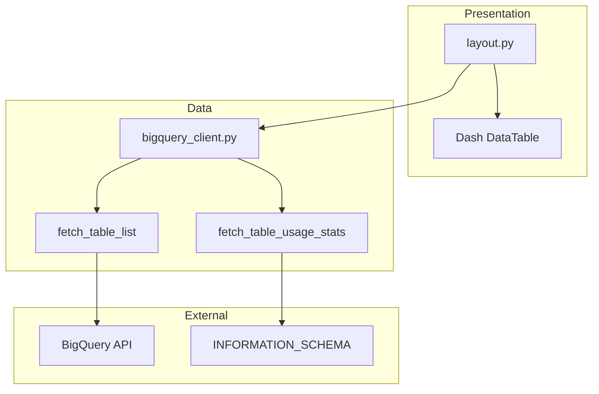
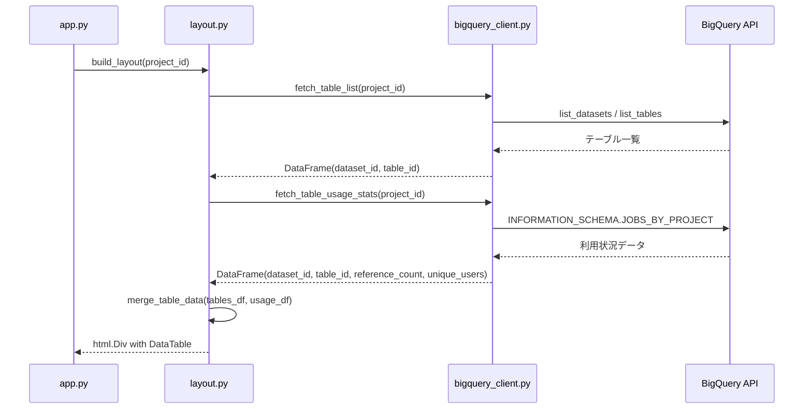

# Design Document

## Overview

**Purpose**: BigQuery INFORMATION_SCHEMA.JOBS_BY_PROJECTビューを活用し、各テーブルの参照回数とユニーク参照ユーザー数を分析するダッシュボード機能を提供する。既存実装でアプリ起動時に取得済みのテーブル一覧データと利用状況データを結合し、Dash DataTableで表形式の可視化を実現する。

**Users**: データ基盤管理者、データエンジニアが以下のワークフローで利用する:
- 全テーブルの利用状況を一覧で確認
- 未使用テーブルの特定とデータ資産管理の意思決定
- テーブル参照パターンの把握

**Impact**: 既存のテーブル一覧表示（go.Table）をDash DataTableに置き換え、INFORMATION_SCHEMAから取得した利用状況データを統合表示する。

### Goals

- INFORMATION_SCHEMA.JOBS_BY_PROJECTからテーブル参照回数・ユニーク参照ユーザー数を取得
- 既存テーブル一覧と利用状況をLEFT JOINで結合し、未使用テーブルも含めて表示
- Dash DataTableによるソート可能な表形式表示
- 未使用テーブル（参照回数0件）の視覚的識別

### Non-Goals

- リアルタイムデータ更新（初期表示時のみデータ取得）
- テーブルリネージ分析（参照元・参照先の関係把握）
- クエリ履歴の詳細表示（ジョブ単位の情報）
- 認証・認可機能の追加（既存のGoogle Cloud認証を継続使用）

## Architecture

### Existing Architecture Analysis

現行システムは以下のレイヤード構造を採用:
- `config.py`: Pydanticによる設定管理（AppConfig）
- `bigquery_client.py`: BigQuery API呼び出し（fetch_table_list）
- `layout.py`: UIコンポーネント構築（build_layout、create_table_figure）
- `app.py`: Dashインスタンス生成（create_app）
- `server.py`: HTTPサーバー起動（run_server）

**既存パターン**:
- アプリ起動時にテーブル一覧を取得（fetch_table_list）
- DataFrameでデータ管理
- Plotly go.Tableで表示

### Architecture Pattern & Boundary Map



**Architecture Integration**:
- 選択パターン: 既存レイヤードアーキテクチャの拡張
- ドメイン境界: bigquery_client.pyにデータ取得ロジックを集約、layout.pyに表示ロジックを集約
- 既存パターン維持: DataFrameベースのデータフロー、Pydantic設定管理
- 新規コンポーネント: fetch_table_usage_stats関数、merge_table_data関数、DataTable表示
- Steering準拠: 単一責任、型安全性、日本語docstring

### Technology Stack

| Layer | Choice / Version | Role in Feature | Notes |
|-------|------------------|-----------------|-------|
| Backend / Services | google-cloud-bigquery 3.x | INFORMATION_SCHEMAクエリ実行 | 既存依存 |
| Data / Storage | pandas 2.x | DataFrame結合・操作 | 既存依存 |
| Frontend / CLI | dash 2.18.x | DataTable表示・ソート | 既存依存 |
| Frontend / CLI | dash-table (dash内包) | 表形式表示・条件付きスタイル | native sort/filter |

## System Flows

### データ取得・表示フロー



**Key Decisions**:
- 2つのBigQueryクエリを順次実行（テーブル一覧 + 利用状況）
- pandas LEFT JOINでデータ結合（未使用テーブルを保持）
- DataTableのnative sortでクライアントサイドソート

## Requirements Traceability

| Requirement | Summary | Components | Interfaces | Flows |
|-------------|---------|------------|------------|-------|
| 1.1 | JOBS_BY_PROJECTからクエリジョブ情報取得 | bigquery_client.py | fetch_table_usage_stats | データ取得フロー |
| 1.2 | テーブルごとの参照回数算出 | bigquery_client.py | fetch_table_usage_stats | データ取得フロー |
| 1.3 | テーブルごとのユニーク参照ユーザー数算出 | bigquery_client.py | fetch_table_usage_stats | データ取得フロー |
| 1.4 | BigQuery APIエラー時のエラーメッセージ表示 | layout.py | build_layout | データ取得フロー |
| 2.1 | LEFT JOINでデータ結合 | layout.py | merge_table_data | データ取得フロー |
| 2.2 | 既存テーブル一覧を基準とする | layout.py | merge_table_data | データ取得フロー |
| 2.3 | 利用実績がないテーブルも結果に含める | layout.py | merge_table_data | データ取得フロー |
| 2.4 | 参照回数0件のテーブルを表示 | layout.py | create_usage_datatable | データ取得フロー |
| 3.1 | DataTableで表形式表示 | layout.py | create_usage_datatable | データ取得フロー |
| 3.2 | テーブルID、データセットID、参照回数、参照ユーザー数を列表示 | layout.py | create_usage_datatable | データ取得フロー |
| 3.3 | 列ヘッダークリックでソート切り替え | layout.py | create_usage_datatable | - |
| 3.4 | 参照回数0件のテーブルを視覚的に識別 | layout.py | create_usage_datatable | - |
| 4.1 | 設定ポートでHTTPサーバー起動 | server.py | run_server | - |
| 4.2 | ダッシュボードURL表示 | layout.py | build_layout | - |
| 4.3 | 環境変数からプロジェクトID読み込み | config.py | AppConfig | - |

## Components and Interfaces

| Component | Domain/Layer | Intent | Req Coverage | Key Dependencies | Contracts |
|-----------|--------------|--------|--------------|------------------|-----------|
| fetch_table_usage_stats | Data | INFORMATION_SCHEMAから利用統計取得 | 1.1, 1.2, 1.3 | BigQuery Client (P0) | Service |
| merge_table_data | Data | テーブル一覧と利用統計のLEFT JOIN | 2.1, 2.2, 2.3, 2.4 | pandas (P0) | Service |
| create_usage_datatable | Presentation | DataTable生成・スタイル設定 | 3.1, 3.2, 3.3, 3.4 | dash_table (P0) | Service |
| build_layout | Presentation | レイアウト構築（既存拡張） | 1.4, 4.2 | BQClient (P0), merge_table_data (P0) | Service |

### Data Layer

#### fetch_table_usage_stats

| Field | Detail |
|-------|--------|
| Intent | INFORMATION_SCHEMA.JOBS_BY_PROJECTからテーブル参照統計を取得 |
| Requirements | 1.1, 1.2, 1.3 |

**Responsibilities & Constraints**
- INFORMATION_SCHEMA.JOBS_BY_PROJECTへのSQLクエリ実行
- referenced_tablesをUNNESTして集計
- テーブルごとの参照回数・ユニークユーザー数をDataFrameで返却
- 過去180日間のジョブ履歴が対象（BigQuery制約）

**Dependencies**
- External: google-cloud-bigquery - BigQuery APIクライアント (P0)
- External: pandas - DataFrame操作 (P0)

**Contracts**: Service [x] / API [ ] / Event [ ] / Batch [ ] / State [ ]

##### Service Interface

```python
def fetch_table_usage_stats(project_id: str, region: str = "region-us") -> DataFrame:
    """対象プロジェクトのテーブル利用統計を取得する。

    Args:
        project_id: GCPプロジェクトID
        region: BigQueryリージョン（デフォルト: region-us）

    Returns:
        利用統計を含むDataFrame。
        カラム: dataset_id (str), table_id (str),
               reference_count (int), unique_users (int)

    Raises:
        ValueError: project_idが空文字の場合
        google.api_core.exceptions.GoogleAPIError: BigQuery API呼び出しに失敗した場合
    """
```

- Preconditions: project_idが非空文字列
- Postconditions: 4カラムのDataFrameを返却（空の場合も同一スキーマ）
- Invariants: 同一(dataset_id, table_id)の組み合わせは一意

**Implementation Notes**
- Integration: INFORMATION_SCHEMA.JOBS_BY_PROJECTは直近180日のデータを保持
- Validation: project_id空文字チェック必須
- Risks: 大量ジョブ履歴がある場合のクエリコスト（10MB最小課金）

#### merge_table_data

| Field | Detail |
|-------|--------|
| Intent | テーブル一覧と利用統計をLEFT JOINで結合 |
| Requirements | 2.1, 2.2, 2.3, 2.4 |

**Responsibilities & Constraints**
- テーブル一覧DataFrameを左側（基準）としてLEFT JOIN
- 利用実績がないテーブルはreference_count=0、unique_users=0で補完
- 結合キー: (dataset_id, table_id)

**Dependencies**
- Inbound: fetch_table_list - テーブル一覧DataFrame (P0)
- Inbound: fetch_table_usage_stats - 利用統計DataFrame (P0)
- External: pandas - DataFrame.merge操作 (P0)

**Contracts**: Service [x] / API [ ] / Event [ ] / Batch [ ] / State [ ]

##### Service Interface

```python
def merge_table_data(
    tables_df: DataFrame,
    usage_df: DataFrame
) -> DataFrame:
    """テーブル一覧と利用統計を結合する。

    Args:
        tables_df: テーブル一覧DataFrame（dataset_id, table_id）
        usage_df: 利用統計DataFrame（dataset_id, table_id, reference_count, unique_users）

    Returns:
        結合済みDataFrame。
        カラム: dataset_id (str), table_id (str),
               reference_count (int), unique_users (int)
        利用実績がないテーブルはreference_count=0、unique_users=0
    """
```

- Preconditions: 両DataFrameがdataset_id, table_idカラムを持つ
- Postconditions: tables_dfの全行を保持、欠損値は0で補完
- Invariants: 出力行数 >= tables_dfの行数

### Presentation Layer

#### create_usage_datatable

| Field | Detail |
|-------|--------|
| Intent | 利用統計をDash DataTableコンポーネントとして生成 |
| Requirements | 3.1, 3.2, 3.3, 3.4 |

**Responsibilities & Constraints**
- DataFrameからDash DataTableを生成
- ネイティブソート機能を有効化
- 参照回数0件の行に条件付きスタイル適用

**Dependencies**
- Inbound: merge_table_data - 結合済みDataFrame (P0)
- External: dash.dash_table - DataTableコンポーネント (P0)

**Contracts**: Service [x] / API [ ] / Event [ ] / Batch [ ] / State [ ]

##### Service Interface

```python
from dash import dash_table

def create_usage_datatable(df: DataFrame) -> dash_table.DataTable:
    """利用統計DataFrameからDataTableコンポーネントを生成する。

    Args:
        df: 結合済み利用統計DataFrame
           （dataset_id, table_id, reference_count, unique_users）

    Returns:
        ソート可能、条件付きスタイル適用済みのDataTableコンポーネント
    """
```

- Preconditions: dfが4カラム（dataset_id, table_id, reference_count, unique_users）を持つ
- Postconditions: sort_action="native"、style_data_conditional設定済み
- Invariants: reference_count=0の行は視覚的に識別可能

**DataTable Configuration**

```python
dash_table.DataTable(
    id="usage-table",
    columns=[
        {"name": "データセットID", "id": "dataset_id"},
        {"name": "テーブルID", "id": "table_id"},
        {"name": "参照回数", "id": "reference_count"},
        {"name": "参照ユーザー数", "id": "unique_users"},
    ],
    data=df.to_dict("records"),
    sort_action="native",
    sort_mode="multi",
    style_data_conditional=[
        {
            "if": {"filter_query": "{reference_count} = 0"},
            "backgroundColor": "#FFCCCC",  # 薄い赤
        }
    ],
    style_header={
        "backgroundColor": "paleturquoise",
        "fontWeight": "bold",
    },
    style_cell={"textAlign": "left"},
)
```

**Implementation Notes**
- Integration: 既存go.TableをDataTableに置き換え
- Validation: DataFrameカラム存在チェック
- Risks: 大量テーブル時のブラウザパフォーマンス（10,000行程度まで問題なし）

#### build_layout (既存拡張)

| Field | Detail |
|-------|--------|
| Intent | ダッシュボードレイアウト構築（利用統計統合） |
| Requirements | 1.4, 4.2 |

**Responsibilities & Constraints**
- fetch_table_list、fetch_table_usage_stats呼び出し
- merge_table_data、create_usage_datatable呼び出し
- GoogleAPIErrorハンドリング・エラーメッセージ表示

**Dependencies**
- Outbound: fetch_table_list - テーブル一覧取得 (P0)
- Outbound: fetch_table_usage_stats - 利用統計取得 (P0)
- Outbound: merge_table_data - データ結合 (P0)
- Outbound: create_usage_datatable - DataTable生成 (P0)

**Contracts**: Service [x] / API [ ] / Event [ ] / Batch [ ] / State [ ]

##### Service Interface

```python
def build_layout(project_id: str | None = None) -> html.Div:
    """ダッシュボードレイアウトを構築する。

    Args:
        project_id: GCPプロジェクトID。Noneの場合はテーブル表示をスキップ。

    Returns:
        ダッシュボードのルートDivコンポーネント。
        エラー発生時はエラーメッセージを含むDivを返却。
    """
```

- Preconditions: project_idがNoneまたは非空文字列
- Postconditions: html.Divを返却（正常時はDataTable、異常時はエラーメッセージ）
- Invariants: GoogleAPIError発生時もhtml.Divを返却

**Implementation Notes**
- Integration: 既存のcreate_table_figure呼び出しをcreate_usage_datatable呼び出しに置き換え
- Validation: project_id Noneチェック継続
- Risks: 2つのAPI呼び出しによる起動時間増加

## Data Models

### Domain Model

**エンティティ**:
- TableInfo: テーブル識別情報（dataset_id, table_id）
- TableUsageStats: テーブル利用統計（reference_count, unique_users）

**集約**:
- TableWithUsage: TableInfo + TableUsageStats（結合後のビュー）

**ビジネスルール**:
- 未使用テーブルはreference_count=0、unique_users=0として表現
- 利用統計は過去180日間のジョブ履歴に基づく

### Logical Data Model

**TableWithUsage DataFrame Schema**:

| Column | Type | Description | Nullable |
|--------|------|-------------|----------|
| dataset_id | str | BigQueryデータセットID | No |
| table_id | str | BigQueryテーブルID | No |
| reference_count | int | 参照回数（クエリジョブ数） | No (default: 0) |
| unique_users | int | ユニーク参照ユーザー数 | No (default: 0) |

**結合ロジック**:
```
TableWithUsage = TableInfo LEFT JOIN TableUsageStats
                 ON (dataset_id, table_id)
                 WITH COALESCE(reference_count, 0), COALESCE(unique_users, 0)
```

### Data Contracts & Integration

**BigQuery SQLクエリ（fetch_table_usage_stats）**:

```sql
SELECT
    t.dataset_id,
    t.table_id,
    COUNT(*) AS reference_count,
    COUNT(DISTINCT user_email) AS unique_users
FROM `{region}`.INFORMATION_SCHEMA.JOBS_BY_PROJECT,
    UNNEST(referenced_tables) AS t
WHERE t.project_id = @project_id
GROUP BY t.dataset_id, t.table_id
```

**パラメータ**:
- region: BigQueryリージョン（例: region-us、region-asia-northeast1）
- project_id: 対象GCPプロジェクトID

**制約**:
- INFORMATION_SCHEMAは直近180日のジョブ履歴を保持
- クエリ課金: 最小10MB

## Error Handling

### Error Strategy

データ取得エラーは即座にUI表示し、部分的な機能提供は行わない（Fail Fast）。

### Error Categories and Responses

**System Errors (5xx)**:
- BigQuery API接続失敗 → エラーメッセージ「BigQuery APIエラー: {詳細}」を表示
- INFORMATION_SCHEMAクエリ失敗 → 同上

**User Errors (4xx)**:
- project_id未設定 → テーブル表示をスキップ（既存動作維持）

### Monitoring

- エラー発生時はUI上にエラーメッセージを表示
- 将来的にはログ出力を追加検討

## Testing Strategy

### Unit Tests

- `test_fetch_table_usage_stats_empty`: 空結果時のDataFrameスキーマ検証
- `test_merge_table_data_left_join`: LEFT JOIN動作確認（未使用テーブル保持）
- `test_merge_table_data_zero_fill`: 欠損値の0補完確認
- `test_create_usage_datatable_columns`: DataTableカラム設定確認
- `test_create_usage_datatable_conditional_style`: 条件付きスタイル設定確認

## Supporting References

### BigQuery INFORMATION_SCHEMA.JOBS_BY_PROJECT

**referenced_tables フィールド**:
- 型: ARRAY<STRUCT<project_id STRING, dataset_id STRING, table_id STRING>>
- クエリジョブが参照したテーブルの一覧
- UNNESTで展開して集計可能

**制約**:
- 直近180日のジョブ履歴を保持
- JOBS_BY_PROJECT requires bigquery.jobs.listAll permission
- クエリ課金: 最小10MB（オンデマンド料金）

**参考リンク**:
- [JOBS view | BigQuery | Google Cloud](https://cloud.google.com/bigquery/docs/information-schema-jobs)
- [Introduction to INFORMATION_SCHEMA | BigQuery | Google Cloud](https://cloud.google.com/bigquery/docs/information-schema-intro)

### Dash DataTable

**ソート機能**:
- `sort_action="native"`: クライアントサイドソート（10,000行程度まで推奨）
- `sort_mode="multi"`: 複数列ソート対応

**条件付きスタイル**:
- `style_data_conditional`: フィルタクエリベースのスタイル適用
- `filter_query`: `{column_name} = value` 形式

**参考リンク**:
- [Sorting, Filtering, Selecting, and Paging Natively | Dash](https://dash.plotly.com/datatable/interactivity)
- [Conditional Formatting | Dash](https://dash.plotly.com/datatable/conditional-formatting)
