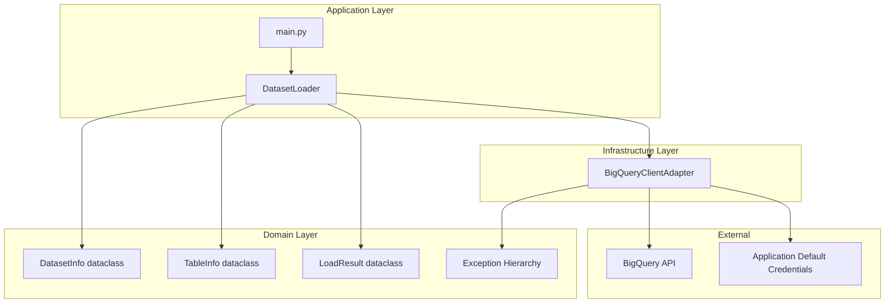
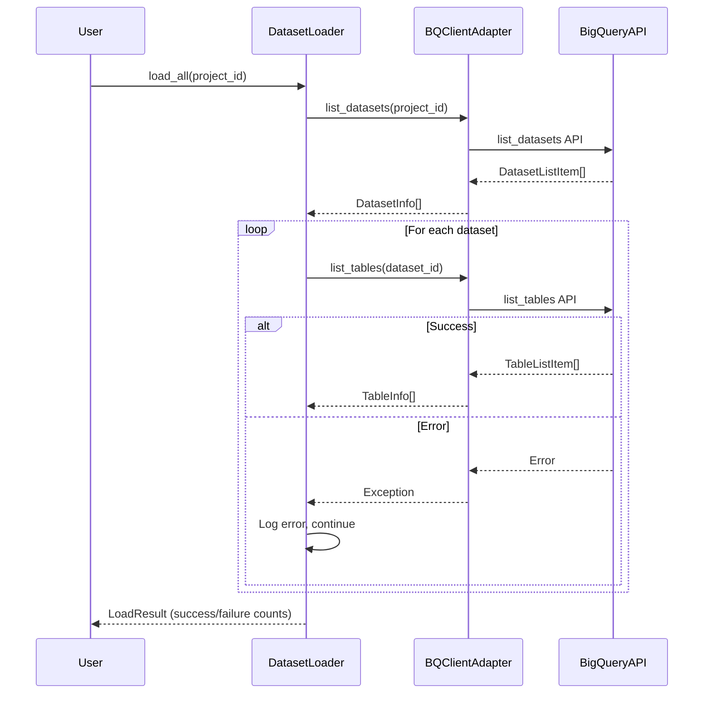
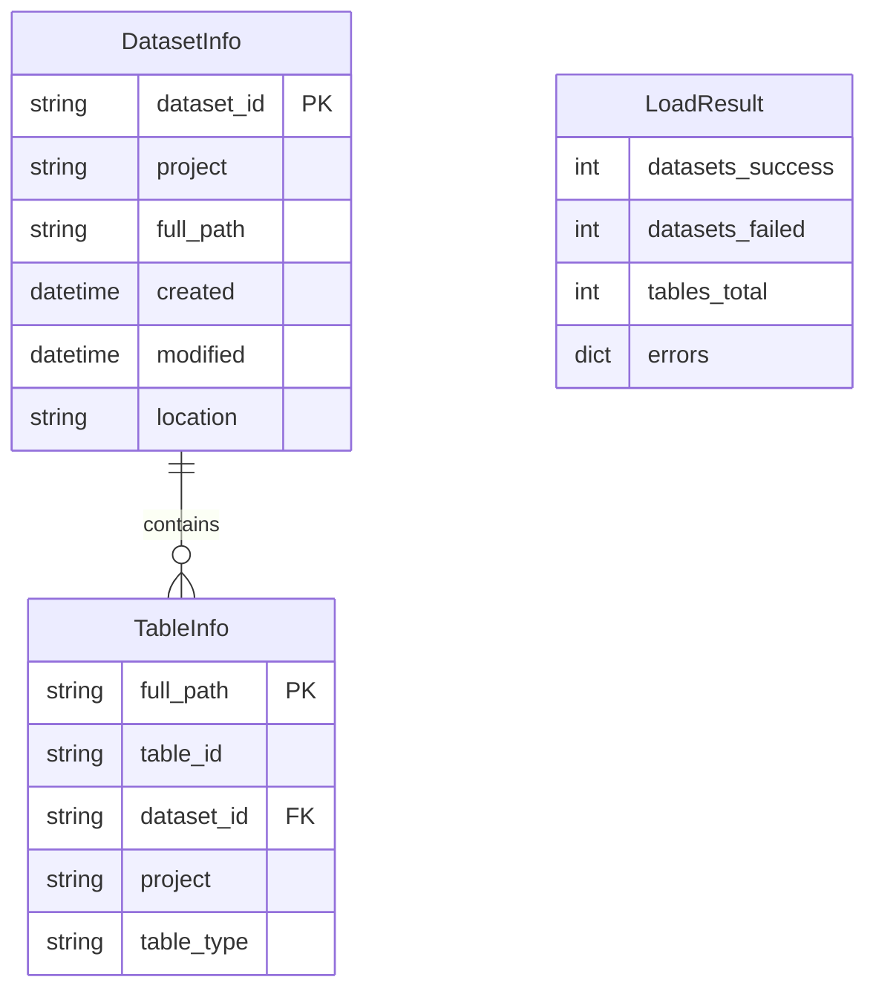

# Design Document

## Overview

**Purpose**: この機能は、BigQuery のデータセットおよびテーブルのメタデータを取得し、Python のオンメモリデータ構造に保存することで、後続の分析処理（テーブル参照回数の集計など）の基盤を提供する。

**Users**: データエンジニアおよび運用担当者が、BigQuery プロジェクト内のデータ資産を把握し、分析処理の入力データとして活用する。

**Impact**: 新規モジュールの追加であり、既存システムへの影響はない。将来の分析機能（INFORMATION_SCHEMA.JOBS や auditlog からの参照回数取得）の前提コンポーネントとなる。

### Goals

- BigQuery プロジェクト内の全データセット・テーブル情報を効率的に取得する
- 型安全なデータ構造でメタデータを保持し、O(1) での検索を実現する
- Application Default Credentials を活用したシームレスな認証を提供する
- エラー発生時も処理を継続し、部分的な結果とサマリーを返却する

### Non-Goals

- テーブルの参照回数集計（本機能のスコープ外、別機能で実装予定）
- テーブルスキーマの詳細取得（将来の拡張として検討）
- リアルタイムでのメタデータ同期（バッチ処理のみ）
- 複数プロジェクトの同時ロード（単一プロジェクトを対象）

## Architecture

### Architecture Pattern & Boundary Map



**Architecture Integration**:
- **Selected pattern**: Repository Pattern + Adapter — BigQuery SDK をラップし、ドメインオブジェクトに変換することでテスト容易性と型安全性を確保
- **Domain/feature boundaries**: DatasetLoader がビジネスロジック（一括ロード、エラー継続）を担当、BQClientAdapter が外部API通信を担当
- **Existing patterns preserved**: steering に定義されたシンプルなフラット構造から段階的に拡張
- **New components rationale**: dataclass によるドメインモデル定義、Adapter による SDK 抽象化
- **Steering compliance**: Python 型ヒントの積極使用、snake_case 命名規約に準拠

### Directory Structure

本プロジェクトの現状は、`main.py` のみのフラット構造である。steering の方針に従い、`src/` ディレクトリを導入してモジュール分割を行う。

```
bigquery-dashboard/
├── pyproject.toml           # プロジェクト設定
├── main.py                  # CLIエントリーポイント
├── README.md
│
├── src/                     # ソースコードルート（パッケージ）
│   └── bq_table_reference/  # メインパッケージ
│       ├── __init__.py      # パッケージ初期化・公開API定義
│       │
│       ├── domain/          # ドメイン層：ビジネスロジックとデータ構造
│       │   ├── __init__.py
│       │   ├── models.py    # DatasetInfo, TableInfo, LoadResult
│       │   └── exceptions.py # カスタム例外階層
│       │
│       ├── infrastructure/  # インフラ層：外部サービス連携
│       │   ├── __init__.py
│       │   └── bq_client_adapter.py  # BigQuery SDK ラッパー
│       │
│       └── application/     # アプリケーション層：ユースケース実装
│           ├── __init__.py
│           └── dataset_loader.py  # DatasetLoader クラス
│
└── tests/                   # テストコード
    ├── __init__.py
    ├── conftest.py          # pytest フィクスチャ
    │
    ├── unit/                # 単体テスト
    │   ├── __init__.py
    │   ├── domain/
    │   │   ├── __init__.py
    │   │   ├── test_models.py      # DatasetInfo, TableInfo, LoadResult
    │   │   └── test_exceptions.py   # 例外クラスのテスト
    │   │
    │   └── application/
    │       ├── __init__.py
    │       └── test_dataset_loader.py  # モック使用のローダーテスト
    │
    └── integration/         # 統合テスト
        ├── __init__.py
        ├── test_bq_client_adapter.py   # 実API使用（オプショナル）
        └── test_dataset_loader_e2e.py  # エンドツーエンド
```

**Key Design Decisions**:

| 決定事項 | 選択 | 根拠 |
|---------|------|------|
| src レイアウト | `src/bq_table_reference/` | PEP 517/518 推奨。インストール可能パッケージとして配布可能 |
| パッケージ名 | `bq_table_reference` | pyproject.toml のプロジェクト名と一致、snake_case 命名規約 |
| レイヤー分離 | domain/infrastructure/application | クリーンアーキテクチャに基づく関心の分離 |
| テスト構造 | unit/integration 分離 | CI での実行速度最適化、統合テストの選択的実行 |

### Technology Stack

| Layer | Choice / Version | Role in Feature | Notes |
|-------|------------------|-----------------|-------|
| Backend / Services | Python 3.14+ | コアロジック実装 | pyproject.toml で定義済み |
| Data / Storage | dataclass (stdlib) | オンメモリデータ構造 | frozen=True でイミュータブル化 |
| Infrastructure / Runtime | google-cloud-bigquery 3.x | BigQuery API クライアント | 新規依存として追加 |
| Infrastructure / Runtime | google-auth (transitive) | ADC 認証 | bigquery パッケージの依存として自動導入 |

## System Flows

### 一括ロード処理フロー



**Key Decisions**:
- データセットごとにテーブル一覧を取得し、1つのデータセットで失敗しても他の処理を継続
- 進捗はロギングまたはコールバックで通知

## Requirements Traceability

| Requirement | Summary | Components | Interfaces | Flows |
|-------------|---------|------------|------------|-------|
| 1.1 | データセット一覧取得 | BQClientAdapter | list_datasets() | - |
| 1.2 | データセット情報の返却 | DatasetInfo | - | - |
| 1.3, 1.4 | 権限/ネットワークエラー処理 | BQClientAdapter, DatasetLoaderError | - | - |
| 2.1 | テーブル一覧取得 | BQClientAdapter | list_tables() | - |
| 2.2 | テーブル情報の返却 | TableInfo | - | - |
| 2.3 | NotFound エラー | BQClientAdapter, DatasetNotFoundError | - | - |
| 2.4 | ページネーション処理 | BQClientAdapter | - | SDK が自動処理 |
| 3.1 | データセット一覧のオンメモリ保持 | DatasetLoader, DatasetInfo | - | - |
| 3.2 | テーブル一覧の親子関連維持 | DatasetLoader, TableInfo | - | - |
| 3.3 | データセットID検索 O(1) | DatasetLoader | get_dataset() | - |
| 3.4 | テーブルフルパス検索 | DatasetLoader | get_table() | - |
| 4.1 | 一括ロード機能 | DatasetLoader | load_all() | 一括ロード処理フロー |
| 4.2 | 進捗通知 | DatasetLoader | ProgressCallback | - |
| 4.3 | エラー継続処理 | DatasetLoader | - | 一括ロード処理フロー |
| 4.4 | サマリー返却 | LoadResult | - | - |
| 5.1 | ADC 認証 | BQClientAdapter | - | - |
| 5.2 | サービスアカウント認証 | BQClientAdapter | - | GOOGLE_APPLICATION_CREDENTIALS |
| 5.3 | 認証エラー通知 | AuthenticationError | - | - |

## Components and Interfaces

| Component | Domain/Layer | Intent | Req Coverage | Key Dependencies | Contracts |
|-----------|--------------|--------|--------------|------------------|-----------|
| DatasetInfo | Domain | データセットメタデータを表現 | 1.2, 3.1 | - | State |
| TableInfo | Domain | テーブルメタデータを表現 | 2.2, 3.2 | - | State |
| LoadResult | Domain | 一括ロード結果を表現 | 4.4 | - | State |
| DatasetLoaderError | Domain | エラー階層のベースクラス | 1.3, 1.4, 2.3, 5.3 | - | - |
| BQClientAdapter | Infrastructure | BigQuery API との通信を抽象化 | 1.1, 2.1, 2.4, 5.1, 5.2 | google-cloud-bigquery (P0) | Service |
| DatasetLoader | Application | ビジネスロジックと検索機能を提供 | 3.1-3.4, 4.1-4.3 | BQClientAdapter (P0) | Service |

### Domain Layer

**File**: `src/bq_table_reference/domain/models.py`

#### DatasetInfo

| Field | Detail |
|-------|--------|
| Intent | BigQuery データセットのメタデータを型安全に表現するイミュータブルなデータ構造 |
| Requirements | 1.2, 3.1 |

**Responsibilities & Constraints**
- データセットの識別情報（ID、プロジェクト、フルパス）を保持
- 作成日時・更新日時のメタデータを保持
- イミュータブル（frozen dataclass）として実装

**Contracts**: State [x]

##### State Management

```python
from dataclasses import dataclass
from datetime import datetime
from typing import Optional

@dataclass(frozen=True)
class DatasetInfo:
    dataset_id: str
    project: str
    full_path: str  # "project.dataset" 形式
    created: Optional[datetime]
    modified: Optional[datetime]
    location: Optional[str]
```

- Immutability: frozen=True により変更不可
- Persistence: オンメモリのみ（永続化なし）

---

#### TableInfo

| Field | Detail |
|-------|--------|
| Intent | BigQuery テーブルのメタデータを型安全に表現するイミュータブルなデータ構造 |
| Requirements | 2.2, 3.2 |

**Responsibilities & Constraints**
- テーブルの識別情報（ID、データセットID、プロジェクト、フルパス）を保持
- テーブル種別（TABLE/VIEW/MATERIALIZED_VIEW/EXTERNAL）を保持
- 親データセットとの関連を full_path で表現

**Contracts**: State [x]

##### State Management

```python
from dataclasses import dataclass
from typing import Literal

TableType = Literal["TABLE", "VIEW", "MATERIALIZED_VIEW", "EXTERNAL"]

@dataclass(frozen=True)
class TableInfo:
    table_id: str
    dataset_id: str
    project: str
    full_path: str  # "project.dataset.table" 形式
    table_type: TableType
```

- Immutability: frozen=True により変更不可
- Parent relationship: dataset_id と project で親データセットを参照可能

---

#### LoadResult

| Field | Detail |
|-------|--------|
| Intent | 一括ロード処理の結果サマリーを表現 |
| Requirements | 4.4 |

**Responsibilities & Constraints**
- 成功・失敗件数を保持
- 失敗したデータセットのエラー詳細を保持

**Contracts**: State [x]

##### State Management

```python
from dataclasses import dataclass, field
from typing import Dict

@dataclass
class LoadResult:
    datasets_success: int
    datasets_failed: int
    tables_total: int
    errors: Dict[str, str] = field(default_factory=dict)  # dataset_id -> エラーメッセージ
```

---

**File**: `src/bq_table_reference/domain/exceptions.py`

#### DatasetLoaderError (Exception Hierarchy)

| Field | Detail |
|-------|--------|
| Intent | BigQuery 操作に関するエラーを分類し、ユーザーフレンドリーなメッセージを提供 |
| Requirements | 1.3, 1.4, 2.3, 5.3 |

**Responsibilities & Constraints**
- google-api-core の例外を適切なカスタム例外に変換
- エラーメッセージに解決方法のガイダンスを含める

```python
class DatasetLoaderError(Exception):
    """DatasetLoader操作のベース例外クラス。"""
    pass

class AuthenticationError(DatasetLoaderError):
    """認証に失敗した場合に発生。"""
    pass

class PermissionDeniedError(DatasetLoaderError):
    """必要な権限がない場合に発生。"""
    pass

class DatasetNotFoundError(DatasetLoaderError):
    """指定されたデータセットが存在しない場合に発生。"""
    pass

class NetworkError(DatasetLoaderError):
    """ネットワークエラーが発生した場合に発生。"""
    pass
```

---

### Infrastructure Layer

**File**: `src/bq_table_reference/infrastructure/bq_client_adapter.py`

#### BQClientAdapter

| Field | Detail |
|-------|--------|
| Intent | BigQuery Python SDK をラップし、ドメインオブジェクトへの変換とエラーハンドリングを提供 |
| Requirements | 1.1, 2.1, 2.4, 5.1, 5.2 |

**Responsibilities & Constraints**
- BigQuery Client のライフサイクル管理
- SDK の DatasetListItem/TableListItem からドメインオブジェクトへの変換
- google-api-core 例外からカスタム例外への変換
- ADC または環境変数指定の認証情報を使用

**Dependencies**
- External: google-cloud-bigquery — BigQuery API クライアント (P0)
- External: google-auth — 認証処理 (P0, transitive)

**Contracts**: Service [x]

##### Service Interface

```python
from typing import Iterator, Optional
from google.cloud import bigquery

class BQClientAdapter:
    def __init__(self, project: Optional[str] = None) -> None:
        """
        BigQueryクライアントでアダプターを初期化する。

        Args:
            project: GCPプロジェクトID。Noneの場合は認証情報のデフォルトを使用。

        Raises:
            AuthenticationError: 有効な認証情報が見つからない場合。
        """
        ...

    def list_datasets(self, project: str) -> Iterator[DatasetInfo]:
        """
        指定プロジェクト内の全データセットを一覧取得する。

        Args:
            project: GCPプロジェクトID。

        Yields:
            DatasetInfo: データセットのメタデータ。

        Raises:
            PermissionDeniedError: bigquery.datasets.list権限がない場合。
            NetworkError: ネットワーク問題が発生した場合。
        """
        ...

    def list_tables(self, dataset_id: str, project: str) -> Iterator[TableInfo]:
        """
        指定データセット内の全テーブルを一覧取得する。

        Args:
            dataset_id: BigQueryデータセットID。
            project: GCPプロジェクトID。

        Yields:
            TableInfo: テーブルのメタデータ。

        Raises:
            DatasetNotFoundError: データセットが存在しない場合。
            PermissionDeniedError: bigquery.tables.list権限がない場合。
            NetworkError: ネットワーク問題が発生した場合。
        """
        ...

    def close(self) -> None:
        """BigQueryクライアントをクローズする。"""
        ...

    def __enter__(self) -> "BQClientAdapter":
        """コンテキストマネージャーのエントリー。"""
        ...

    def __exit__(self, exc_type, exc_val, exc_tb) -> None:
        """コンテキストマネージャーのイグジット。"""
        ...
```

- Preconditions: 有効な認証情報が環境に設定されていること
- Postconditions: イテレータは全ての結果を返却後に終了
- Invariants: クライアントは close() 呼び出しまで再利用可能

**Implementation Notes**
- Integration: `google.cloud.bigquery.Client` をラップし、コンテキストマネージャーとしても使用可能にする
- Validation: project/dataset_id の形式検証は SDK に委譲
- Risks: SDK のバージョンアップによる API 変更

---

### Application Layer

**File**: `src/bq_table_reference/application/dataset_loader.py`

#### DatasetLoader

| Field | Detail |
|-------|--------|
| Intent | データセット・テーブルのロード、オンメモリ保持、検索機能を提供するファサード |
| Requirements | 3.1, 3.2, 3.3, 3.4, 4.1, 4.2, 4.3 |

**Responsibilities & Constraints**
- BQClientAdapter を使用してデータを取得
- 辞書によるインデックスで O(1) 検索を実現
- 一括ロード時のエラー継続処理
- 進捗通知（ログまたはコールバック）

**Dependencies**
- Inbound: main.py — エントリーポイントから呼び出し (P0)
- Outbound: BQClientAdapter — BigQuery API 通信 (P0)

**Contracts**: Service [x] / State [x]

##### Service Interface

```python
from typing import Callable, Optional, Protocol

class ProgressCallback(Protocol):
    def __call__(self, current: int, total: int, dataset_id: str) -> None:
        """
        一括ロード中の進捗を報告するために呼び出される。

        Args:
            current: これまでに処理されたデータセット数。
            total: 処理対象のデータセット総数。
            dataset_id: 処理中のデータセットID。
        """
        ...

class DatasetLoader:
    def __init__(
        self,
        adapter: Optional[BQClientAdapter] = None,
        project: Optional[str] = None
    ) -> None:
        """
        ローダーを初期化する。

        Args:
            adapter: 事前設定済みのアダプター（オプション）。Noneの場合は新規作成。
            project: GCPプロジェクトID。adapterがNoneの場合は必須。

        Raises:
            AuthenticationError: 有効な認証情報が見つからない場合。
        """
        ...

    def load_all(
        self,
        project: str,
        on_progress: Optional[ProgressCallback] = None
    ) -> LoadResult:
        """
        プロジェクトから全データセットとテーブルをロードする。

        Args:
            project: GCPプロジェクトID。
            on_progress: 進捗報告用のコールバック（オプション）。

        Returns:
            LoadResult: 成功/失敗件数のサマリー。

        Note:
            個別データセットでのエラーはログに記録されLoadResult.errorsに保存されるが、
            他のデータセットの処理は継続される。
        """
        ...

    def get_dataset(self, dataset_id: str) -> Optional[DatasetInfo]:
        """
        IDでデータセット情報を取得する。

        Args:
            dataset_id: BigQueryデータセットID。

        Returns:
            見つかった場合はDatasetInfo、それ以外はNone。

        計算量: O(1)
        """
        ...

    def get_table(self, full_path: str) -> Optional[TableInfo]:
        """
        フルパスでテーブル情報を取得する。

        Args:
            full_path: "project.dataset.table"形式のテーブルフルパス。

        Returns:
            見つかった場合はTableInfo、それ以外はNone。
        """
        ...

    def get_tables_by_dataset(self, dataset_id: str) -> list[TableInfo]:
        """
        データセット内の全テーブルを取得する。

        Args:
            dataset_id: BigQueryデータセットID。

        Returns:
            TableInfoオブジェクトのリスト。データセットが見つからない場合は空リスト。
        """
        ...

    @property
    def datasets(self) -> list[DatasetInfo]:
        """ロード済みの全データセットを返す。"""
        ...

    @property
    def tables(self) -> list[TableInfo]:
        """ロード済みの全テーブルを返す。"""
        ...
```

- Preconditions: load_all() が少なくとも1回呼び出されていること（検索メソッド使用時）
- Postconditions: 検索結果は load_all() 時点のスナップショット
- Invariants: 内部データ構造は外部から変更不可

##### State Management

```python
# 内部状態の構造
class DatasetLoader:
    _datasets: dict[str, DatasetInfo]          # dataset_id -> DatasetInfo
    _tables: dict[str, TableInfo]              # full_path -> TableInfo
    _tables_by_dataset: dict[str, list[TableInfo]]  # dataset_id -> [TableInfo]
```

- Persistence: オンメモリのみ
- Consistency: load_all() 呼び出しで全て更新（インクリメンタル更新なし）

**Implementation Notes**
- Integration: ロギングには標準 logging モジュールを使用
- Validation: full_path のフォーマット検証は get_table() 内で実施
- Risks: 大規模プロジェクトでのメモリ使用量増加

---

### Package Initialization

**File**: `src/bq_table_reference/__init__.py`

```python
"""BigQuery テーブル参照分析ツール。

データセットとテーブルのメタデータを取得・管理するためのパッケージ。

Examples:
    >>> from bq_table_reference import DatasetLoader
    >>> loader = DatasetLoader(project="my-project")
    >>> result = loader.load_all("my-project")
    >>> print(f"Loaded {result.datasets_success} datasets")
"""

from bq_table_reference.domain.models import (
    DatasetInfo,
    TableInfo,
    LoadResult,
    TableType,
)
from bq_table_reference.domain.exceptions import (
    DatasetLoaderError,
    AuthenticationError,
    PermissionDeniedError,
    DatasetNotFoundError,
    NetworkError,
)
from bq_table_reference.application.dataset_loader import (
    DatasetLoader,
    ProgressCallback,
)

__all__ = [
    # Domain Models
    "DatasetInfo",
    "TableInfo",
    "LoadResult",
    "TableType",
    # Exceptions
    "DatasetLoaderError",
    "AuthenticationError",
    "PermissionDeniedError",
    "DatasetNotFoundError",
    "NetworkError",
    # Application
    "DatasetLoader",
    "ProgressCallback",
]

__version__ = "0.1.0"
```

## Data Models

### Domain Model



**Aggregates and Boundaries**:
- DatasetInfo と TableInfo は独立したエンティティとして管理
- LoadResult は一括ロード処理の結果を表現する値オブジェクト

**Business Rules & Invariants**:
- full_path は一意であること
- table_type は定義された Literal 値のみ許可
- DatasetInfo/TableInfo はイミュータブル

### Logical Data Model

**Structure Definition**:
- DatasetInfo: dataset_id をキーとする辞書でインデックス
- TableInfo: full_path をキーとする辞書でインデックス
- 追加で dataset_id をキーとして TableInfo のリストを保持（親子関連の効率的な取得）

**Indexing Strategy**:

| Index | Key | Value | Purpose |
|-------|-----|-------|---------|
| _datasets | dataset_id | DatasetInfo | O(1) データセット検索 |
| _tables | full_path | TableInfo | O(1) テーブル検索 |
| _tables_by_dataset | dataset_id | list[TableInfo] | データセット単位のテーブル一覧取得 |

## Error Handling

### Error Strategy

BigQuery API からのエラーを適切なカスタム例外に変換し、ユーザーが対処可能なメッセージを提供する。

### Error Categories and Responses

**User Errors (4xx equivalent)**:
- `PermissionDeniedError`: 必要な IAM 権限がない場合。メッセージに必要なロール（bigquery.user 等）を含める
- `DatasetNotFoundError`: 指定されたデータセットが存在しない場合

**System Errors (5xx equivalent)**:
- `NetworkError`: ネットワーク接続の問題。リトライを推奨するメッセージを含める
- `AuthenticationError`: 認証情報が見つからない/無効な場合。`gcloud auth application-default login` の実行を案内

**Error Mapping**:

| google-api-core Exception | Custom Exception |
|--------------------------|------------------|
| `google.auth.exceptions.DefaultCredentialsError` | `AuthenticationError` |
| `google.api_core.exceptions.Forbidden` | `PermissionDeniedError` |
| `google.api_core.exceptions.NotFound` | `DatasetNotFoundError` |
| `google.api_core.exceptions.ServiceUnavailable` | `NetworkError` |
| `requests.exceptions.ConnectionError` | `NetworkError` |

### Monitoring

- 標準 logging モジュールを使用してエラーを記録
- load_all() 処理中のエラーは WARNING レベルでログ出力
- 認証エラーは ERROR レベルでログ出力

## Testing Strategy

### Unit Tests

**Location**: `tests/unit/`

- `test_models.py`: DatasetInfo, TableInfo, LoadResult dataclass の生成と属性アクセス
- `test_exceptions.py`: 例外クラスの継承関係とメッセージ
- `test_dataset_loader.py`: モック BQClientAdapter を使用した DatasetLoader のテスト
  - get_dataset(), get_table() の O(1) 検索動作
  - load_all() のエラー継続処理

### Integration Tests

**Location**: `tests/integration/`

- `test_bq_client_adapter.py`: 実際の BigQuery API との通信（テスト用プロジェクト使用）
- `test_dataset_loader_e2e.py`: 一括ロード処理のエンドツーエンド動作
- `test_authentication.py`: ADC および GOOGLE_APPLICATION_CREDENTIALS による認証

### Mock Tests

- `tests/unit/application/test_dataset_loader.py`: BQClientAdapter をモック化した DatasetLoader のテスト
- 各種エラーシナリオのシミュレーション
- 一括ロード中の部分失敗シナリオ

### Test Configuration

**File**: `tests/conftest.py`

```python
import pytest
from typing import Iterator

@pytest.fixture
def mock_adapter():
    """モック化された BQClientAdapter を提供する。"""
    ...

@pytest.fixture
def sample_dataset_info():
    """テスト用 DatasetInfo インスタンスを提供する。"""
    ...

@pytest.fixture
def sample_table_info():
    """テスト用 TableInfo インスタンスを提供する。"""
    ...
```

## Security Considerations

- **認証情報の管理**: サービスアカウントキーファイルのハードコーディングは禁止。環境変数または ADC を使用
- **最小権限の原則**: 必要な IAM ロールは `roles/bigquery.dataViewer` のみ（データセット・テーブルのメタデータ読み取り）
- **ログ出力**: 認証情報やプロジェクトIDの機密情報はログに出力しない

## Performance & Scalability

- **API 呼び出し回数**: データセット数 + 1 回（list_datasets 1回 + list_tables がデータセット数分）
- **メモリ使用量**: データセット・テーブル数に比例。1000 テーブルで約 1MB 以下を想定
- **並列処理**: 初期実装では逐次処理。将来的に concurrent.futures による並列化を検討
- **キャッシュ**: 初期実装ではなし。頻繁なリロードが必要な場合は TTL 付きキャッシュを検討
