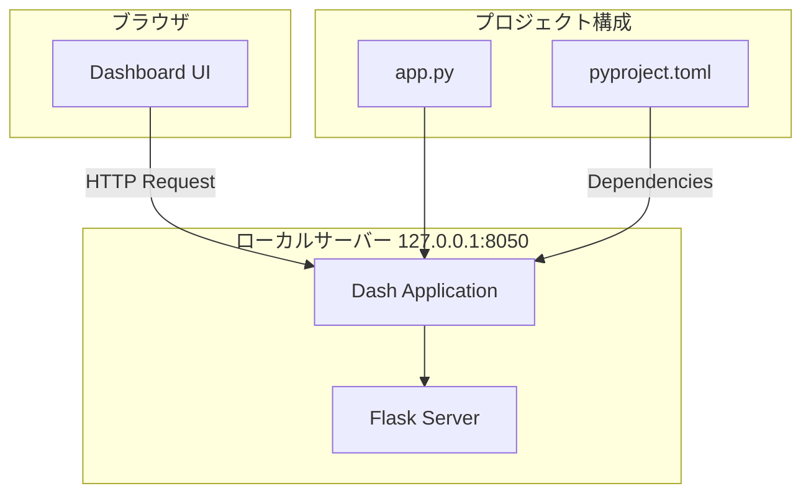
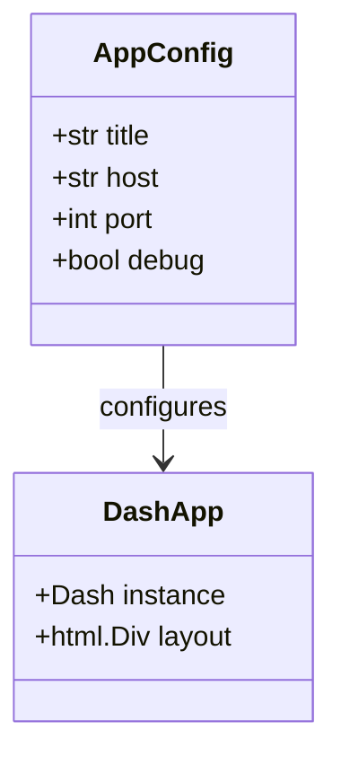

# Design Document: Dashダッシュボード初期化

## Overview

**Purpose**: この機能は、Python Dashフレームワークを使用したダッシュボードアプリケーションの基盤を提供する。開発者はローカル環境でDashアプリケーションを起動し、BigQueryテーブル利用状況の可視化に向けた開発基盤を構築できる。

**Users**: 開発者がダッシュボード開発の基盤として使用し、最終的にはデータ分析者がBigQueryテーブルの利用状況を確認するために使用する。

**Impact**: 既存のBigQuery分析プロジェクトに、Web UIコンポーネントを新規追加する。

### Goals
- Dashアプリケーションの初期化と基本レイアウトの確立
- ローカルホストでのサーバー起動機能の実装
- 開発効率を高めるデバッグモード（ホットリロード）のサポート
- 将来の機能拡張に対応できるプロジェクト構成の確立

### Non-Goals
- BigQueryとの実際のデータ連携
- 本番環境へのデプロイ設定
- 認証・認可機能
- マルチページアプリケーション構成（将来のスコープ）

## Architecture

> 詳細な調査結果は`research.md`を参照。本セクションでは設計決定と構成を記載する。

### Architecture Pattern & Boundary Map



**Architecture Integration**:
- **Selected pattern**: Single Module with Package Foundation
  - 初期化フェーズに適したシンプルな構成
  - 将来的なsrc/パッケージへの移行を考慮
- **Domain/feature boundaries**: ダッシュボードUIは独立したモジュールとして管理
- **Existing patterns preserved**: 既存のpyproject.toml、uvパッケージマネージャーを維持
- **New components rationale**: app.pyをエントリーポイントとして追加
- **Steering compliance**: Pydanticによる設定管理、pyrightによる型チェックを維持

### Technology Stack

| Layer | Choice / Version | Role in Feature | Notes |
|-------|------------------|-----------------|-------|
| Frontend / CLI | Dash 2.18.x | Webダッシュボードフレームワーク | Flask内蔵、React.jsベース |
| Backend / Services | Flask (Dash内蔵) | HTTPサーバー | Dashが自動管理 |
| Infrastructure / Runtime | Python 3.13, uv | 実行環境、依存関係管理 | 既存プロジェクト設定を継続 |

> Dash 2.18.x系を選択した理由は`research.md`の「Dashバージョンの選択」を参照。

#### サードパーティーパッケージ

- **dash** (2.18.x) - Webダッシュボードフレームワーク本体
- **pydantic** (2.x) - 設定管理とバリデーション

## Requirements Traceability

| Requirement | Summary | Components | Interfaces | Flows |
|-------------|---------|------------|------------|-------|
| 1.1 | Dashインスタンス作成 | DashApplication | create_app() | 初期化フロー |
| 1.2 | アプリケーション名設定 | DashApplication | AppConfig | 初期化フロー |
| 1.3 | デフォルトレイアウト設定 | LayoutBuilder | build_layout() | 初期化フロー |
| 2.1 | ローカルホスト起動 | ServerRunner | run_server() | サーバー起動フロー |
| 2.2 | デフォルトポート設定 | ServerConfig | port: int | サーバー起動フロー |
| 2.3 | 起動URL表示 | ServerRunner | run_server() | サーバー起動フロー |
| 2.4 | HTTPリクエスト受付 | Flask (内蔵) | - | サーバー起動フロー |
| 3.1 | ダッシュボードページ表示 | LayoutBuilder | build_layout() | レイアウト表示フロー |
| 3.2 | 基本HTML構造 | LayoutBuilder | html.Div, html.H1 | レイアウト表示フロー |
| 3.3 | タイトル設定 | LayoutBuilder | TITLE定数 | レイアウト表示フロー |
| 4.1 | デバッグモード有効化 | ServerRunner | debug: bool | サーバー起動フロー |
| 4.2 | 自動リロード | Dash (内蔵) | - | サーバー起動フロー |
| 4.3 | エラー詳細表示 | Dash (内蔵) | - | サーバー起動フロー |
| 5.1 | エントリーポイント | app.py | main() | 初期化フロー |

## Components and Interfaces

| Component | Domain/Layer | Intent | Req Coverage | Key Dependencies | Contracts |
|-----------|--------------|--------|--------------|------------------|-----------|
| DashApplication | Application | Dashアプリインスタンス管理 | 1.1, 1.2, 1.3 | Dash (P0) | Service, State |
| LayoutBuilder | UI | レイアウト構築 | 3.1, 3.2, 3.3 | dash.html (P0) | Service |
| ServerRunner | Infrastructure | サーバー起動管理 | 2.1, 2.2, 2.3, 2.4, 4.1, 4.2, 4.3 | Flask (P0) | Service |
| AppConfig | Configuration | アプリケーション設定 | 1.2, 2.2, 4.1 | Pydantic (P0) | State |

### Application Layer

#### DashApplication

| Field | Detail |
|-------|--------|
| Intent | Dashアプリケーションインスタンスの作成と設定を管理する |
| Requirements | 1.1, 1.2, 1.3 |

**Responsibilities & Constraints**
- Dashインスタンスの生成と初期化
- アプリケーションタイトルの設定
- レイアウトのアタッチ
- 単一インスタンスとして管理（モジュールレベル）

**Dependencies**
- External: Dash framework - アプリケーション基盤 (P0)
- Outbound: LayoutBuilder - レイアウト取得 (P0)
- Outbound: AppConfig - 設定値取得 (P1)

**Contracts**: Service [x] / API [ ] / Event [ ] / Batch [ ] / State [x]

##### Service Interface

```python
from dash import Dash

def create_app(config: AppConfig) -> Dash:
    """
    Dashアプリケーションインスタンスを生成する。

    Args:
        config: アプリケーション設定

    Returns:
        初期化されたDashインスタンス

    Raises:
        ValueError: 無効な設定が渡された場合
    """
    ...
```

- Preconditions: configは有効なAppConfigインスタンス
- Postconditions: Dashインスタンスが生成され、layoutが設定されている
- Invariants: アプリケーション名は空文字列でない

##### State Management
- State model: モジュールレベルのDashインスタンス (`app: Dash`)
- Persistence: メモリ内のみ（サーバー実行中）
- Concurrency strategy: 単一プロセス、Flaskのスレッド管理に委譲

**Implementation Notes**
- Integration: `if __name__ == "__main__":`ブロックでエントリーポイントを提供
- Validation: AppConfigでPydantic検証を実施
- Risks: Python 3.13との互換性は起動時テストで確認

---

#### LayoutBuilder

| Field | Detail |
|-------|--------|
| Intent | ダッシュボードの基本レイアウトを構築する |
| Requirements | 3.1, 3.2, 3.3 |

**Responsibilities & Constraints**
- HTMLコンポーネントの階層構造を定義
- タイトル「BigQueryテーブル利用状況」を表示
- 基本的なヘッダーとコンテナ構造を提供

**Dependencies**
- External: dash.html - HTMLコンポーネント (P0)
- External: dash.dcc - Core Components (P1、将来の拡張用)

**Contracts**: Service [x] / API [ ] / Event [ ] / Batch [ ] / State [ ]

##### Service Interface

```python
from dash import html

def build_layout() -> html.Div:
    """
    ダッシュボードの基本レイアウトを構築する。

    Returns:
        ルートDivコンポーネント（タイトルとヘッダーを含む）
    """
    ...

# 定数
TITLE: str = "BigQueryテーブル利用状況"
```

- Preconditions: なし
- Postconditions: 有効なDash HTMLコンポーネントツリーを返す
- Invariants: TITLEは「BigQueryテーブル利用状況」固定

**Implementation Notes**
- Integration: DashApplicationからcreate_app()内で呼び出し
- Validation: コンポーネント構造はDashフレームワークが検証
- Risks: 特になし

---

### Infrastructure Layer

#### ServerRunner

| Field | Detail |
|-------|--------|
| Intent | Dashサーバーの起動と設定を管理する |
| Requirements | 2.1, 2.2, 2.3, 2.4, 4.1, 4.2, 4.3 |

**Responsibilities & Constraints**
- ローカルホスト(127.0.0.1)でのサーバー起動
- デフォルトポート8050での待受
- デバッグモードの有効化/無効化
- 起動URLのコンソール表示

**Dependencies**
- Inbound: DashApplication - Dashインスタンス (P0)
- External: Flask server (Dash内蔵) - HTTP処理 (P0)

**Contracts**: Service [x] / API [ ] / Event [ ] / Batch [ ] / State [ ]

##### Service Interface

```python
from dash import Dash

def run_server(
    app: Dash,
    host: str = "127.0.0.1",
    port: int = 8050,
    debug: bool = True
) -> None:
    """
    Dashサーバーを起動する。

    Args:
        app: Dashアプリケーションインスタンス
        host: バインドするホストアドレス
        port: リッスンするポート番号
        debug: デバッグモードの有効/無効

    Note:
        この関数はブロッキング呼び出し。
        Ctrl+Cで終了するまで制御を返さない。
    """
    ...
```

- Preconditions: appは有効なDashインスタンス、portは1024-65535の範囲
- Postconditions: サーバーが起動し、HTTPリクエストを受け付ける状態
- Invariants: debug=Trueの場合、ホットリロードが有効

**Implementation Notes**
- Integration: app.run()メソッドをラップして追加ロギングを提供
- Validation: ポート番号の範囲チェック
- Risks: ポート競合時のエラーハンドリング

---

### Configuration Layer

#### AppConfig

| Field | Detail |
|-------|--------|
| Intent | アプリケーション設定を型安全に管理する |
| Requirements | 1.2, 2.2, 4.1 |

**Responsibilities & Constraints**
- 設定値のバリデーション
- デフォルト値の提供
- 型安全なアクセス

**Dependencies**
- External: Pydantic - バリデーション (P0)

**Contracts**: Service [ ] / API [ ] / Event [ ] / Batch [ ] / State [x]

##### State Management

```python
from pydantic import BaseModel, Field

class AppConfig(BaseModel):
    """アプリケーション設定"""

    title: str = Field(
        default="BigQueryテーブル利用状況",
        min_length=1,
        description="ダッシュボードのタイトル"
    )
    host: str = Field(
        default="127.0.0.1",
        description="サーバーバインドアドレス"
    )
    port: int = Field(
        default=8050,
        ge=1024,
        le=65535,
        description="サーバーポート番号"
    )
    debug: bool = Field(
        default=True,
        description="デバッグモードの有効/無効"
    )
```

- State model: イミュータブルな設定オブジェクト
- Persistence: 起動時にインスタンス化、メモリ内保持
- Concurrency strategy: イミュータブルのため競合なし

**Implementation Notes**
- Integration: create_app()の引数として渡す
- Validation: Pydanticが起動時に検証
- Risks: 特になし

## Data Models

### Domain Model

本フェーズでは複雑なドメインモデルは不要。設定値のみをモデル化する。



**Entities & Value Objects**:
- `AppConfig`: 値オブジェクト（イミュータブル設定）
- `DashApp`: アプリケーションインスタンス（ランタイムエンティティ）

**Business Rules & Invariants**:
- タイトルは空文字列でないこと
- ポートは1024-65535の範囲
- ホストは有効なIPアドレス形式

## Error Handling

### Error Strategy

シンプルな初期化フェーズのため、最小限のエラーハンドリングを実装する。

### Error Categories and Responses

**User Errors (4xx)**:
- 設定値が無効 -> Pydantic ValidationErrorで起動時に通知

**System Errors (5xx)**:
- ポート競合 -> OSError捕捉、明確なエラーメッセージ表示
- モジュールインポートエラー -> 依存関係の確認を促すメッセージ

**Business Logic Errors (422)**:
- 該当なし（本フェーズでは複雑なビジネスロジックなし）

### Monitoring

- 起動時ログ: サーバーURL、デバッグモード状態を出力
- エラーログ: 例外発生時にスタックトレースを出力（debug=True時）

## Testing Strategy

### Unit Tests
- `test_create_app`: Dashインスタンスが正しく生成されることを確認
- `test_build_layout`: レイアウトにタイトルが含まれることを確認
- `test_app_config_validation`: 無効な設定でValidationErrorが発生することを確認

### Integration Tests
- `test_server_startup`: サーバーが正常に起動することを確認
- `test_layout_rendering`: ブラウザアクセス時にHTMLが返されることを確認
