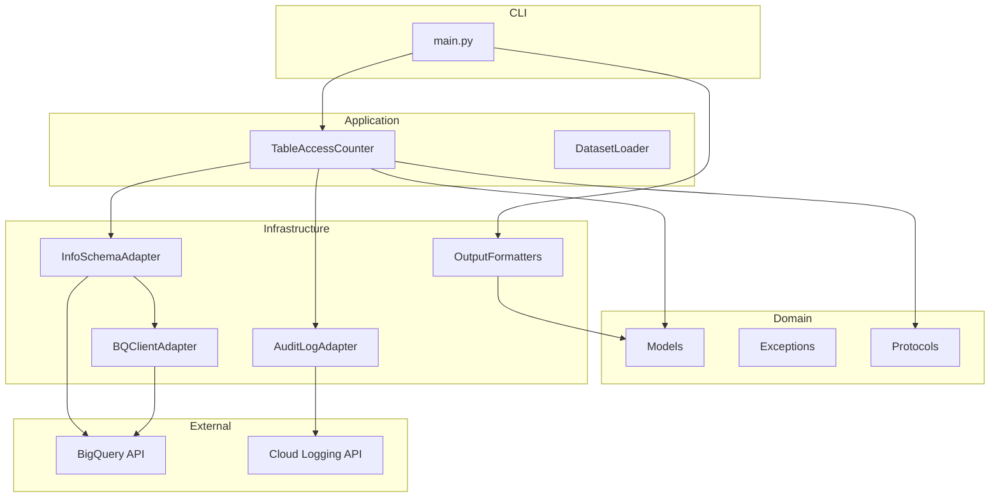
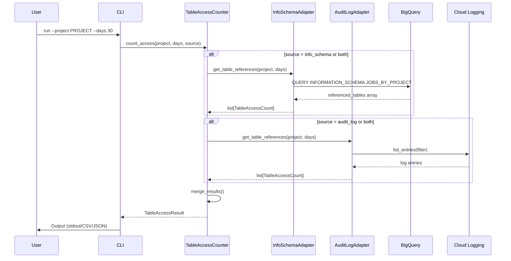
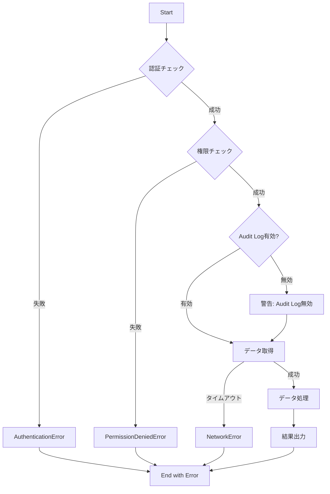
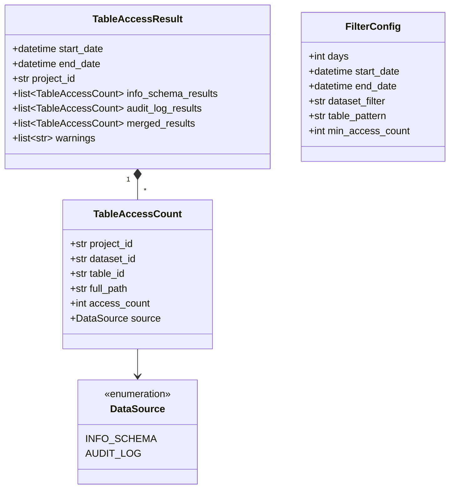

# Design Document

## Overview

**Purpose**: この機能は、BigQueryのINFORMATION_SCHEMAとCloud Audit Logsの両方からテーブル参照回数を取得・集計し、データ基盤運用者とデータエンジニアに対してテーブル利用状況の可視化を提供する。

**Users**: データ基盤運用者とデータエンジニアが、未使用テーブルの特定、ストレージコスト最適化、データガバナンスレポート作成のワークフローで活用する。

**Impact**: 既存のレイヤードアーキテクチャ (Domain/Application/Infrastructure) に新しいモジュール群を追加し、CLIインターフェースを拡張する。

### Goals

- INFORMATION_SCHEMA.JOBS_BY_PROJECT からテーブル参照回数を正確に取得する
- Cloud Audit Logs の tableDataRead イベントからテーブル参照回数を取得する
- 両データソースの結果を統合・比較可能な形式で出力する
- CSV/JSON 形式でのエクスポートをサポートする
- 期間指定・フィルタリング機能を提供する

### Non-Goals

- リアルタイムモニタリングやアラート機能
- テーブル参照の詳細なクエリ内容の分析
- 他のクラウドプロバイダー (AWS/Azure) のデータウェアハウス対応
- Web UI やダッシュボード機能
- JOBS_BY_ORGANIZATION によるクロスプロジェクト分析 (将来検討)

## Architecture

### Existing Architecture Analysis

現在のコードベースはレイヤードアーキテクチャを採用している:

- **Domain層**: `DatasetInfo`, `TableInfo`, `LoadResult` モデルと例外階層
- **Application層**: `DatasetLoader` によるユースケース実装
- **Infrastructure層**: `BQClientAdapter` によるBigQuery API抽象化

既存パターン:
- Pydantic BaseModel による型安全なドメインモデル (frozen=True)
- Protocol による依存性逆転 (ProgressCallback)
- コンテキストマネージャーによるリソース管理
- 例外階層による詳細なエラーハンドリング

### Architecture Pattern & Boundary Map



**Architecture Integration**:
- Selected pattern: 既存レイヤードアーキテクチャの拡張
- Domain/feature boundaries: データソースごとにアダプターを分離し、共通 Protocol で統一
- Existing patterns preserved: Pydantic モデル、例外階層、コンテキストマネージャー
- New components rationale: 新データソース (Audit Logs) 対応と出力形式の多様化
- Steering compliance: 型安全性、レイヤー分離、アダプターパターンを維持

### Technology Stack

| Layer | Choice / Version | Role in Feature | Notes |
|-------|------------------|-----------------|-------|
| CLI | argparse (stdlib) | コマンドライン引数解析 | 既存踏襲 |
| Backend / Services | Python 3.14+ | アプリケーション実行 | 既存踏襲 |
| Data / Storage | BigQuery (INFORMATION_SCHEMA) | テーブル参照データ取得 | 既存 |
| Data / Storage | Cloud Logging API | Audit Logs 取得 | **新規** |
| Infrastructure | google-cloud-bigquery | BigQuery クライアント | 既存 |
| Infrastructure | google-cloud-logging (3.11+) | Cloud Logging クライアント | **新規追加** |

## System Flows

### テーブル参照回数取得フロー



### エラーハンドリングフロー



## Requirements Traceability

| Requirement | Summary | Components | Interfaces | Flows |
|-------------|---------|------------|------------|-------|
| 1.1, 1.2, 1.3, 1.4 | INFORMATION_SCHEMAからテーブル参照取得 | InfoSchemaAdapter, TableAccessCounter | TableReferenceSource Protocol | テーブル参照回数取得フロー |
| 1.5 | 権限エラーハンドリング | InfoSchemaAdapter | PermissionDeniedError | エラーハンドリングフロー |
| 2.1, 2.2, 2.3, 2.4 | Audit Logsからテーブル参照取得 | AuditLogAdapter, TableAccessCounter | TableReferenceSource Protocol | テーブル参照回数取得フロー |
| 2.5, 2.6 | Audit Log権限・有効化エラー | AuditLogAdapter | PermissionDeniedError, AuditLogNotEnabledError | エラーハンドリングフロー |
| 3.1, 3.2, 3.3 | データソース統合 | TableAccessCounter | TableAccessResult | テーブル参照回数取得フロー |
| 3.4, 3.5 | データソース選択 | TableAccessCounter, CLI | DataSourceOption | テーブル参照回数取得フロー |
| 4.1, 4.2, 4.3, 4.4, 4.5 | 結果出力 | OutputFormatter群, CLI | OutputFormatter Protocol | 出力フロー |
| 5.1, 5.2, 5.3, 5.4, 5.5 | フィルタリング・期間指定 | FilterConfig, TableAccessCounter | FilterConfig | テーブル参照回数取得フロー |
| 6.1, 6.2, 6.3, 6.4, 6.5 | エラーハンドリング | Exception群, TableAccessCounter | 例外階層 | エラーハンドリングフロー |

## Components and Interfaces

| Component | Domain/Layer | Intent | Req Coverage | Key Dependencies (P0/P1) | Contracts |
|-----------|--------------|--------|--------------|--------------------------|-----------|
| TableAccessCount | Domain | テーブル参照回数を表現 | 1.3, 2.3, 3.1, 4.5 | - | State |
| TableAccessResult | Domain | 集計結果全体を表現 | 3.1, 3.2, 4.1 | TableAccessCount (P0) | State |
| FilterConfig | Domain | フィルタ条件を表現 | 5.1, 5.2, 5.3, 5.4 | - | State |
| TableReferenceSource | Domain | データソースアダプターの共通Protocol | 1, 2 | - | Service |
| OutputFormatter | Domain | 出力フォーマッターの共通Protocol | 4 | - | Service |
| TableAccessCounter | Application | テーブル参照回数集計のユースケース | 1, 2, 3, 5, 6 | InfoSchemaAdapter (P0), AuditLogAdapter (P0) | Service |
| InfoSchemaAdapter | Infrastructure | INFORMATION_SCHEMAからのデータ取得 | 1 | BQClientAdapter (P0), BigQuery API (P0) | Service |
| AuditLogAdapter | Infrastructure | Cloud Audit Logsからのデータ取得 | 2 | Cloud Logging API (P0) | Service |
| ConsoleOutputFormatter | Infrastructure | 標準出力フォーマッター | 4.1, 4.2 | - | Service |
| CsvOutputFormatter | Infrastructure | CSVファイル出力 | 4.3 | - | Service |
| JsonOutputFormatter | Infrastructure | JSONファイル出力 | 4.4 | - | Service |

### Domain

#### TableAccessCount

| Field | Detail |
|-------|--------|
| Intent | 単一テーブルの参照回数情報を表現するイミュータブルなデータ構造 |
| Requirements | 1.3, 2.3, 3.1, 4.5 |

**Responsibilities & Constraints**
- プロジェクト、データセット、テーブル単位での参照回数を保持
- データソース情報を含み、どのソースからの集計かを識別可能
- イミュータブル (frozen=True)

**Contracts**: State [x]

##### State Management

```python
class DataSource(Enum):
    """データソース種別"""
    INFO_SCHEMA = "info_schema"
    AUDIT_LOG = "audit_log"

class TableAccessCount(BaseModel):
    """テーブル参照回数を表現するデータ構造"""
    model_config = ConfigDict(frozen=True)

    project_id: str
    dataset_id: str
    table_id: str
    full_path: str  # project.dataset.table 形式
    access_count: int
    source: DataSource
```

---

#### TableAccessResult

| Field | Detail |
|-------|--------|
| Intent | 集計処理全体の結果を表現するデータ構造 |
| Requirements | 3.1, 3.2, 4.1 |

**Responsibilities & Constraints**
- 集計期間、データソース別の結果を保持
- 統合結果と個別結果の両方を提供

**Contracts**: State [x]

##### State Management

```python
class TableAccessResult(BaseModel):
    """テーブル参照回数集計結果"""

    start_date: datetime
    end_date: datetime
    project_id: str
    info_schema_results: list[TableAccessCount]
    audit_log_results: list[TableAccessCount]
    merged_results: list[TableAccessCount]  # 統合結果
    warnings: list[str]  # 警告メッセージ (期間制限など)
```

---

#### FilterConfig

| Field | Detail |
|-------|--------|
| Intent | フィルタリング条件を表現するデータ構造 |
| Requirements | 5.1, 5.2, 5.3, 5.4 |

**Responsibilities & Constraints**
- 期間、データセット、テーブルパターン、最小参照回数の条件を保持
- バリデーションを提供

**Contracts**: State [x]

##### State Management

```python
class FilterConfig(BaseModel):
    """フィルタリング条件"""
    model_config = ConfigDict(frozen=True)

    days: int = 30  # 過去N日
    start_date: datetime | None = None  # オプション: 明示的な開始日
    end_date: datetime | None = None  # オプション: 明示的な終了日
    dataset_filter: str | None = None  # データセット名フィルタ
    table_pattern: str | None = None  # テーブル名パターン (正規表現)
    min_access_count: int = 0  # 最小参照回数
```

---

#### TableReferenceSource (Protocol)

| Field | Detail |
|-------|--------|
| Intent | データソースアダプターの共通インターフェース |
| Requirements | 1, 2 |

**Responsibilities & Constraints**
- INFORMATION_SCHEMA と Audit Log の両アダプターが実装
- 依存性逆転を実現

**Contracts**: Service [x]

##### Service Interface

```python
class TableReferenceSource(Protocol):
    """テーブル参照データソースの共通Protocol"""

    def get_table_references(
        self,
        project_id: str,
        filter_config: FilterConfig,
        on_progress: ProgressCallback | None = None,
    ) -> list[TableAccessCount]:
        """テーブル参照回数を取得する

        Args:
            project_id: GCPプロジェクトID
            filter_config: フィルタリング条件
            on_progress: 進捗コールバック

        Returns:
            テーブル参照回数のリスト

        Raises:
            AuthenticationError: 認証失敗時
            PermissionDeniedError: 権限不足時
            NetworkError: ネットワークエラー時
        """
        ...
```

---

#### OutputFormatter (Protocol)

| Field | Detail |
|-------|--------|
| Intent | 出力フォーマッターの共通インターフェース |
| Requirements | 4 |

**Responsibilities & Constraints**
- 複数の出力形式をサポート
- Strategy パターンによる出力形式の切り替え

**Contracts**: Service [x]

##### Service Interface

```python
class OutputFormatter(Protocol):
    """出力フォーマッターの共通Protocol"""

    def format(
        self,
        result: TableAccessResult,
        output_path: Path | None = None,
    ) -> str | None:
        """結果をフォーマットして出力する

        Args:
            result: 集計結果
            output_path: 出力先パス (Noneの場合は戻り値で返す)

        Returns:
            文字列出力の場合はフォーマット済み文字列、ファイル出力の場合はNone
        """
        ...
```

---

### Application

#### TableAccessCounter

| Field | Detail |
|-------|--------|
| Intent | テーブル参照回数集計のユースケースを実装するファサード |
| Requirements | 1, 2, 3, 5, 6 |

**Responsibilities & Constraints**
- 複数データソースからのデータ取得を調整
- 結果の統合とマージ処理
- エラーハンドリングと部分成功のサポート
- 進捗報告の調整

**Dependencies**
- Inbound: CLI (main.py) - ユースケース呼び出し (P0)
- Outbound: InfoSchemaAdapter - INFORMATION_SCHEMA データ取得 (P0)
- Outbound: AuditLogAdapter - Audit Log データ取得 (P0)

**Contracts**: Service [x]

##### Service Interface

```python
class DataSourceOption(Enum):
    """データソース選択オプション"""
    INFO_SCHEMA = "info_schema"
    AUDIT_LOG = "audit_log"
    BOTH = "both"

class TableAccessCounter:
    """テーブル参照回数集計のユースケース実装"""

    def __init__(
        self,
        info_schema_adapter: TableReferenceSource | None = None,
        audit_log_adapter: TableReferenceSource | None = None,
        project: str | None = None,
        region: str = "us",
    ) -> None:
        """初期化

        Args:
            info_schema_adapter: INFORMATION_SCHEMA アダプター
            audit_log_adapter: Audit Log アダプター
            project: GCPプロジェクトID
            region: BigQueryリージョン (デフォルト: us)
        """
        ...

    def count_access(
        self,
        project_id: str,
        filter_config: FilterConfig,
        source: DataSourceOption = DataSourceOption.BOTH,
        on_progress: ProgressCallback | None = None,
    ) -> TableAccessResult:
        """テーブル参照回数を集計する

        Args:
            project_id: GCPプロジェクトID
            filter_config: フィルタリング条件
            source: データソース選択
            on_progress: 進捗コールバック

        Returns:
            集計結果

        Raises:
            AuthenticationError: 認証失敗時
            PermissionDeniedError: 権限不足時
            NetworkError: ネットワークエラー時
        """
        ...

    def _merge_results(
        self,
        info_schema_results: list[TableAccessCount],
        audit_log_results: list[TableAccessCount],
    ) -> list[TableAccessCount]:
        """両データソースの結果をマージする

        同一テーブルへの参照は、各ソースの値を保持しつつ
        統合ビューでは最大値を採用する
        """
        ...
```

**Implementation Notes**
- Integration: 既存 DatasetLoader と同様のファサードパターンを採用
- Validation: FilterConfig の期間が INFORMATION_SCHEMA 保持期間 (180日) を超える場合は警告
- Risks: 両データソースのエラー時は部分成功として処理継続

---

### Infrastructure

#### InfoSchemaAdapter

| Field | Detail |
|-------|--------|
| Intent | INFORMATION_SCHEMA.JOBS_BY_PROJECT からテーブル参照情報を取得 |
| Requirements | 1.1, 1.2, 1.3, 1.4, 1.5 |

**Responsibilities & Constraints**
- JOBS_BY_PROJECT ビューへのSQLクエリ実行
- referenced_tables の展開と集計
- リージョン指定の管理

**Dependencies**
- Outbound: BQClientAdapter - BigQuery クエリ実行 (P0)
- External: BigQuery INFORMATION_SCHEMA API (P0)

**Contracts**: Service [x]

##### Service Interface

```python
class InfoSchemaAdapter:
    """INFORMATION_SCHEMAからテーブル参照情報を取得するアダプター"""

    def __init__(
        self,
        bq_adapter: BQClientAdapter,
        region: str = "us",
    ) -> None:
        """初期化

        Args:
            bq_adapter: BigQueryクライアントアダプター
            region: BigQueryリージョン
        """
        ...

    def get_table_references(
        self,
        project_id: str,
        filter_config: FilterConfig,
        on_progress: ProgressCallback | None = None,
    ) -> list[TableAccessCount]:
        """INFORMATION_SCHEMAからテーブル参照回数を取得

        Raises:
            PermissionDeniedError: bigquery.jobs.listAll権限がない場合
            NetworkError: ネットワークエラー時
        """
        ...
```

**Implementation Notes**
- Integration: 既存 BQClientAdapter に `run_query()` メソッドを追加
- Validation: リージョンパラメータの検証
- Risks: 大規模プロジェクトでのクエリタイムアウト - バッチ処理で対応

---

#### AuditLogAdapter

| Field | Detail |
|-------|--------|
| Intent | Cloud Audit Logs から tableDataRead イベントを取得 |
| Requirements | 2.1, 2.2, 2.3, 2.4, 2.5, 2.6 |

**Responsibilities & Constraints**
- Cloud Logging API を使用したログエントリ取得
- tableDataRead イベントのフィルタリングとパース
- Audit Log 有効化状態の検出

**Dependencies**
- External: Cloud Logging API - google-cloud-logging ライブラリ (P0)

**Contracts**: Service [x]

##### Service Interface

```python
class AuditLogAdapter:
    """Cloud Audit Logsからテーブル参照情報を取得するアダプター"""

    def __init__(
        self,
        project: str | None = None,
    ) -> None:
        """初期化

        Args:
            project: GCPプロジェクトID

        Raises:
            AuthenticationError: 認証失敗時
        """
        ...

    def get_table_references(
        self,
        project_id: str,
        filter_config: FilterConfig,
        on_progress: ProgressCallback | None = None,
    ) -> list[TableAccessCount]:
        """Audit Logsからテーブル参照回数を取得

        Raises:
            PermissionDeniedError: logging.logEntries.list権限がない場合
            AuditLogNotEnabledError: Data Access ログが有効化されていない場合
            NetworkError: ネットワークエラー時
        """
        ...

    def check_audit_log_enabled(self, project_id: str) -> bool:
        """Data Access ログが有効化されているか確認"""
        ...
```

**Implementation Notes**
- Integration: google-cloud-logging ライブラリの `list_entries()` を使用
- Validation: Audit Log が返されない場合は有効化状態を確認
- Risks: API レート制限 - ページネーションとバックオフリトライで対応

---

#### OutputFormatter 群 (Summary)

| Component | Intent | Req Coverage |
|-----------|--------|--------------|
| ConsoleOutputFormatter | 標準出力への表形式出力 | 4.1, 4.2 |
| CsvOutputFormatter | CSVファイル出力 | 4.3 |
| JsonOutputFormatter | JSONファイル出力 | 4.4 |

各フォーマッターは OutputFormatter Protocol を実装し、TableAccessResult を指定形式で出力する。

**Implementation Notes**
- Integration: CLI でオプションに応じてフォーマッターを選択
- Validation: 出力パスの存在確認とパーミッションチェック

## Data Models

### Domain Model



**Business Rules & Invariants**:
- `TableAccessCount.full_path` は `{project_id}.{dataset_id}.{table_id}` 形式
- `TableAccessCount.access_count` は 0 以上
- `FilterConfig.days` は 1 以上 180 以下 (INFORMATION_SCHEMA の保持期間制限)
- `FilterConfig.min_access_count` は 0 以上

### Logical Data Model

**Entity Relationships**:
- `TableAccessResult` は複数の `TableAccessCount` を集約
- `TableAccessCount` は単一の `DataSource` を参照

**Consistency & Integrity**:
- 全てのドメインモデルは Pydantic BaseModel で定義
- イミュータブル設計 (frozen=True) により不変性を保証

## Error Handling

### Error Strategy

既存の例外階層を拡張し、新しいエラーケースに対応する。

### Error Categories and Responses

**User Errors (認証・権限)**:
- `AuthenticationError`: 認証失敗 - `gcloud auth application-default login` の実行を案内
- `PermissionDeniedError`: 権限不足 - 必要なIAMロールを案内

**System Errors (インフラ)**:
- `NetworkError`: 接続失敗/タイムアウト - リトライ方法を案内
- `TimeoutError`: クエリタイムアウト - タイムアウト設定の調整を案内

**Business Logic Errors**:
- `AuditLogNotEnabledError`: Audit Log 未有効化 - 有効化手順を案内
- `PeriodExceedsRetentionError`: 期間が保持期間を超過 - 警告として処理継続

### New Exception Classes

```python
class AuditLogNotEnabledError(DatasetLoaderError):
    """Data Access Audit Logが有効化されていない場合の例外"""

    def __init__(self, message: str | None = None) -> None:
        if message is None:
            message = (
                "BigQuery Data Access ログが有効化されていません。"
                "Cloud Console > IAM & Admin > Audit Logs から "
                "BigQuery の Data Read を有効化してください。"
            )
        super().__init__(message)

class TimeoutError(DatasetLoaderError):
    """クエリタイムアウトの例外"""

    def __init__(self, message: str | None = None) -> None:
        if message is None:
            message = (
                "クエリがタイムアウトしました。--timeout オプションで "
                "タイムアウト時間を延長するか、期間を短くしてください。"
            )
        super().__init__(message)
```

### Monitoring

- 全てのエラーは Python logging モジュールでログ出力
- 要件 6.5 に従い、予期しないエラーはスタックトレースをログに記録
- 進捗表示は既存の ProgressCallback パターンを使用

## Testing Strategy

### Unit Tests

- `test_table_access_count.py`: TableAccessCount モデルのバリデーション
- `test_filter_config.py`: FilterConfig のバリデーションとデフォルト値
- `test_table_access_counter.py`: TableAccessCounter のマージロジック
- `test_info_schema_adapter.py`: SQL クエリ生成と結果パース (モック使用)
- `test_audit_log_adapter.py`: フィルタ構築とログパース (モック使用)

### Integration Tests

- `test_info_schema_integration.py`: 実際の BigQuery INFORMATION_SCHEMA へのクエリ
- `test_audit_log_integration.py`: 実際の Cloud Logging API へのアクセス
- `test_output_formatters.py`: ファイル出力の検証

### Performance/Load

- 大規模プロジェクト (1000+ テーブル) での集計性能テスト
- Cloud Logging API のページネーション処理テスト
- タイムアウト設定の検証

## Security Considerations

- 認証は既存の Application Default Credentials (ADC) を使用
- 必要な IAM ロール:
  - INFORMATION_SCHEMA: `roles/bigquery.resourceViewer` または `bigquery.jobs.listAll` 権限
  - Audit Logs: `roles/logging.viewer` または `logging.logEntries.list` 権限
- センシティブデータ (クエリ内容等) はログに出力しない
